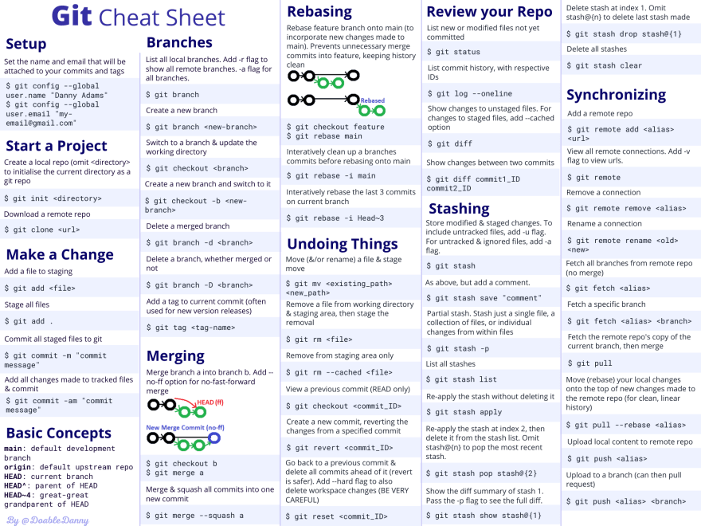

- [Ubuntu](#ubuntu)
  - [Apps](#apps)
    - [Ksnip: image annotation tool](#ksnip-image-annotation-tool)
    - [Redshift: color temperature tool](#redshift-color-temperature-tool)
    - [UMLet: drawing UML diagrams](#umlet-drawing-uml-diagrams)
    - [Crackling sound fix](#crackling-sound-fix)
    - [Gnome shell extensions](#gnome-shell-extensions)
  - [Terminal](#terminal)
    - [tree](#tree)
    - [open](#open)
    - [starship](#starship)
    - [auto-completion](#auto-completion)
    - [command history](#command-history)
    - [change to homebrew color scheme](#change-to-homebrew-color-scheme)
  - [Other](#other)
    - [Extending Virtualbox disk space](#extending-virtualbox-disk-space)
    - [Click to minimize](#click-to-minimize)
- [Visual Studio Code](#visual-studio-code)
  - [Terminal settings](#terminal-settings)
  - [Keyboard shortcuts](#keyboard-shortcuts)
  - [Extensions](#extensions)
- [Cheat sheets](#cheat-sheets)
  - [Ubuntu shortcuts](#ubuntu-shortcuts)
  - [VSCode shortcuts](#vscode-shortcuts)
  - [VSCode extension: C/C++ snippets](#vscode-extension-cc-snippets)
  - [Terminal commands](#terminal-commands)
  - [Unix filesystem](#unix-filesystem)
  - [Git commands](#git-commands)
  - [GDB commands](#gdb-commands)

# Ubuntu

## Apps

### Ksnip: image annotation tool

```
sudo snap install ksnip
```

### Redshift: color temperature tool

```
sudo apt install redshift redshift-gtk
```

[source](https://linoxide.com/install-and-use-redshift-on-ubuntu-20-04/)

### UMLet: drawing UML diagrams

```
sudo apt-get install -y umlet
```

### Crackling sound fix

[source](https://askubuntu.com/questions/1110422/crackling-sound-when-playing-youtube-ubuntu-18-04-1-running-on-virtualbox-6-0)

### Gnome shell extensions

[Setup & Install](https://linuxconfig.org/how-to-install-gnome-shell-extensions-on-ubuntu-20-04-focal-fossa-linux-desktop)

[Gnome extensions](https://itsfoss.com/best-gnome-extensions/)

[Hide Activities Button](https://extensions.gnome.org/extension/744/hide-activities-button/)

[Wintile](https://github.com/fmstrat/wintile)

## Terminal

### tree

```
sudo apt install tree
```

### open

Open current directory in terminal by typing `open .`

`gedit ~/.bashrc`

Add the following line:

`alias open='xdg-open'`

### starship

[Link](https://opensource.com/article/22/2/customize-prompt-starship)

### auto-completion

```
bind "TAB:menu-complete"
bind "set show-all-if-ambiguous on"
bind "TAB:complete"; bind "set show-all-if-ambiguous off"
```

[source](https://unix.stackexchange.com/questions/55203/bash-autocomplete-first-list-files-then-cycle-through-them)

### command history

[source](https://gist.github.com/petewarden/0c653bd41cb225ded69ed9af3a0c8c34)

### change to homebrew color scheme


Color codes:

- Default color (Text): #28FE14
- Default color (Background): #000000
- Highlight color (Background): #051BFF
  
| #000000  | #C33720  | #FB3640 | #A5ABAF  | #29D719 | #A36AC7 | #3971ED | #CCCCCC |
|---|---|---|---|---|---|---|---|

(top and bottom row = same)

## Other

### Extending Virtualbox disk space

[Link 1](https://linuxhint.com/increase-virtualbox-disk-size/)

[Link 2](https://gparted.org/display-doc.php%3Fname%3Dmoving-space-between-partitions)

### Click to minimize

[source](https://itsfoss.com/click-to-minimize-ubuntu/)


# Visual Studio Code

## Terminal settings

Settings -> Terminal -> Integrated -> Automation Profile: Linux

```json
{
    "workbench.colorTheme": "Visual Studio Light - C++",
    "git.confirmSync": false,

    "workbench.colorCustomizations": {
        "terminal.background":"#1D1F21",
        "terminal.foreground":"#00FF00",
        "terminalCursor.background":"#C5C8C6",
        "terminalCursor.foreground":"#C5C8C6",
        "terminal.ansiBlack":"#1D1F21",
        "terminal.ansiBlue":"#3971ED",
        "terminal.ansiBrightBlack":"#969896",
        "terminal.ansiBrightBlue":"#00FF00",
        "terminal.ansiBrightCyan":"#3971ED",
        "terminal.ansiBrightGreen":"#51b837",
        "terminal.ansiBrightMagenta":"#A36AC7",
        "terminal.ansiBrightRed":"#CC342B",
        "terminal.ansiBrightWhite":"#FFFFFF",
        "terminal.ansiBrightYellow":"#FBA922",
        "terminal.ansiCyan":"#3971ED",
        "terminal.ansiGreen":"#1D1F21",
        "terminal.ansiMagenta":"#00FF00",
        "terminal.ansiRed":"#CC342B",
        "terminal.ansiWhite":"#C5C8C6",
        "terminal.ansiYellow":"#FBA922",
        "terminal.selectionBackground": "#00FF00"
    },
    "testMate.cpp.log.userId": "2b6ec97f4dff59272c92ff1211b8d2f1b4c10127",
    "testMate.cpp.log.logSentry": "enable",
    "cmake.configureOnOpen": false,
    "terminal.integrated.cursorStyle": "line",
    "terminal.integrated.cursorBlinking": true,
    "terminal.integrated.fontFamily": "Liberation Mono",
    "terminal.integrated.fontSize": 14,
    "terminal.external.linuxExec": "x-terminal-emulator",
    "terminal.integrated.defaultProfile.linux": "bash",
    "github.gitProtocol": "ssh",
    "terminal.integrated.enableMultiLinePasteWarning": false,
    "git.suggestSmartCommit": false,
}
```

## Keyboard shortcuts

Settings -> Open Keyboard Shortcuts (JSON)

```json
// Place your key bindings in this file to override the defaultsauto[]
[
    {
        "key": "alt+s",
        "command": "markdown.extension.editing.toggleCodeSpan",
        "when": "editorTextFocus && markdownShortcuts:enabled"
    },
    {
        "key": "alt+b",
        "command": "md-shortcut.toggleCodeBlock",
        "when": "editorTextFocus && markdownShortcuts:enabled"
    },
    {
        "key": "alt+h",
        "command": "md-shortcut.toggleLink",
        "when": "editorTextFocus && markdownShortcuts:enabled"
    },
    {
        "key": "home",
        "command": "cursorLineStart"
    },
    {
        "key": "end",
        "command": "cursorLineEnd"
    },
    {
        "key": "alt+left",
        "command": "cursorWordLeftSelect",
        "when": "textInputFocus"
    },
    {
        "key": "alt+right",
        "command": "cursorWordEndRightSelect",
        "when": "textInputFocus"
    },
    {
        "key": "ctrl+left",
        "command": "cursorHomeSelect",
        "when": "textInputFocus"
    },
    {
        "key": "ctrl+right",
        "command": "cursorEndSelect",
        "when": "textInputFocus"
    },
    {
        "key": "tab",
        "command": "editor.action.indentLines",
        "when": "editorTextFocus && !editorReadonly"
    },
    {
        "key": "ctrl+b",
        "command": "-md-shortcut.toggleBold",
        "when": "editorTextFocus && markdownShortcuts:enabled"
    },
    {
        "key": "ctrl+m ctrl+b",
        "command": "-md-shortcut.toggleBullets",
        "when": "editorTextFocus && markdownShortcuts:enabled"
    },
    {
        "key": "ctrl+b",
        "command": "-markdown.extension.editing.toggleBold",
        "when": "editorTextFocus && !editorReadonly && editorLangId == 'markdown'"
    },
    {
        "key": "ctrl+shift+v",
        "command": "-markdown.showPreview",
        "when": "!notebookEditorFocused && editorLangId == 'markdown'"
    },
    {
        "key": "ctrl+shift+v",
        "command": "-markdown.extension.closePreview",
        "when": "markdownPreviewFocus"
    }
]
```

## Extensions

- Markdown All in One
- Markdown Preview Github Styling
- Markdown Shortcuts
- C/C++ Snippets


# Cheat sheets

## Ubuntu shortcuts

Shortcut | Actions
---------|----------
`Ctrl` + `Home` | Launch home folder
`Ctrl` + `End` | Launch terminal
`Super` + `PgUp` | Switch to workspace 1
`Super` + `PgDown` | Switch to workspace 2 
`Print Screen` | Take a screenshot of the desktop 
`Alt`+`Print Screen` | Take a screenshot of a window
`Shift`+`Print Screen` | Take a screenshot of an area you select 
`Ctrl` + `Delete` | Close window
`Ctrl` + `Insert` | Hide window
`F2` | Rename file/folder

[dconf](https://wiki.ubuntu.com/Keybindings)

## VSCode shortcuts


Shortcut | Action
---------|----------
`Ctrl`+`B` | Toggle Sidebar visibility
`Ctrl`+`[`/`]` | Indent/Outdent line
`Ctrl`+`/` | Toggle line comment
`Ctrl`+`Space` | Trigger suggestion
`F2` | Rename symbol
`F3` | Find next
`F11` | Toggle full screen
`F12` | Go to definition
`Shift`+ `Alt` + `ArrUp/ArrDown` | Insert cursor above/below 
`Ctrl` + ` | Toggle terminal
`Ctrl` + `\` | Split editor
`Ctrl` + `1/2/3` | Focus into 1,2,3 editor group

## VSCode extension: C/C++ snippets

[source](https://marketplace.visualstudio.com/items?itemName=hars.CppSnippets)


Keyword | Description | Output
---------|----------|---------
`#def` | B1 | `#define "" ""`
 A2 | B2 | C2
 A3 | B3 | C3

<table>
<tr>
<td> Keyword </td> <td> Output </td>
</tr>
<tr>
<td> #def </td> 
<td>

```cpp
#define "" "" 
```

</td>
</td>
<tr>
<td> #if </td> 
<td>

```cpp
#ifdef 0

#endif // 0
```

</td>
</tr>
<tr>
<td> #ifdef </td> 
<td>

```cpp
#ifdef DEBUG

#endif // DEBUG
```

</td>
</tr>
<tr>
<td> #ifndef </td> 
<td>

```cpp
#ifndef 1

#endif // !1
```

</td>
</tr>
<tr>
<td> #inc </td> 
<td>

```cpp
#include "" 
```

</td>
</tr>
<tr>
<td> #inc< </td> 
<td>

```cpp
#include <> 
```

</td>
</tr>
<tr>
<td> class </td> 
<td>

```cpp
class MyClass
{
public:
    MyClass();
    MyClass(MyClass &&) = default;
    MyClass(const MyClass &) = default;
    MyClass &operator=(MyClass &&) = default;
    MyClass &operator=(const MyClass &) = default;
    ~MyClass();

private:
    
};

MyClass::MyClass()
{
}

MyClass::~MyClass()
{
} 
```

</td>
</tr>
<tr>
<td> classi </td> 
<td>

```cpp
class MyClass
{
public:
    MyClass() = default;
    MyClass(MyClass &&) = default;
    MyClass(const MyClass &) = default;
    MyClass &operator=(MyClass &&) = default;
    MyClass &operator=(const MyClass &) = default;
    ~MyClass() = default;

private:
    
};
```

</td>
</tr>
<tr>
<td> cout </td> 
<td>

```cpp
std::cout << "/* message */" << std::endl; 
```

</td>
</tr>
<tr>
<td> do </td> 
<td>

```cpp
do
{
    
} while();
```

</td>
</tr>
<tr>
<td> else </td> 
<td>

```cpp
else
{
    
}
```

</td>
</tr>
<tr>
<td> else if </td> 
<td>

```cpp
else if ()
{
    
}
```

</td>
</tr>
<tr>
<td> enum </td> 
<td>

```cpp
enum MyEnum
{
    
};
```

</td>
</tr>
<tr>
<td> enum class </td> 
<td>

```cpp
enum class MyClass { };
```

</td>
</tr>
<tr>
<td> for </td> 
<td>

```cpp
for (size_t i = 0; i < length; i++)
{
    
}
```

</td>
</tr>
<tr>
<td> foreach </td> 
<td>

```cpp
for(auto var : collection_to_loop)
{
    
}
```

</td>
</tr>
<tr>
<td> forr </td> 
<td>

```cpp
for (int i = length - 1; i >= 0; i--)
{
    
}
```

</td>
</tr>
<tr>
<td> if </td> 
<td>

```cpp
if ()
{
    
}
```

</td>
</tr>
<tr>
<td> interface </td> 
<td>

```cpp
__interface IInterface
{
    
};
```

</td>
</tr>
<tr>
<td> main </td> 
<td>

```cpp
int main(int argc, const char** argv) {
    return 0;
}
```

</td>
</tr>
<tr>
<td> namespace </td> 
<td>

```cpp
namespace MyNamespace
{
    
}
```

</td>
</tr>
<tr>
<td> struct </td> 
<td>

```cpp
struct MyStruct
{
    
};
```

</td>
</tr>
<tr>
<td> switch </td> 
<td>

```cpp
switch (switch_on)
{
default:
    break;
}
```

</td>
</tr>
<tr>
<td> try </td> 
<td>

```cpp
try
{
    
}
catch (const std::exception&)
{
    
} 
```

</td>
</tr>
<tr>
<td> union </td> 
<td>

```cpp
union MyUnion
{
    
};
```

</td>
</tr>
<tr>
<td> while </td> 
<td>

```cpp
while ()
{
    
}
```

</td>
</tr>

</table>


## Terminal commands


## Unix filesystem


## Git commands



## GDB commands


